# Distributed Scalable Design

This document captures:

- The current reservation flow and mechanics in this codebase.
- What changes in a distributed (multi-instance) deployment.
- A phased upgrade path to retain no-oversell guarantees.
- A Kafka-partitioned target architecture with operational guidance.

## 1) Current Flow and Mechanics

The current implementation is a strong single-process foundation with event-sourced reservation lifecycle management.

### Core Behavior

- `ReservationAggregate` is the write model and enforces lifecycle invariants:
  - `ACTIVE` can become `CONFIRMED` or `EXPIRED` only.
  - Expired reservations cannot be confirmed.
  - Transition out of `ACTIVE` is one-way.
- `ReserveItemUseCase` does four critical actions under a per-item lock:
  - Expires stale holds inline.
  - Applies idempotency (same user + item active hold).
  - Computes availability as `total - confirmed - active`.
  - Appends `ReservationCreated`.
- `ConfirmReservationUseCase` runs under the same lock boundary:
  - Re-checks expiry.
  - Appends `ReservationConfirmed` (or `ReservationExpired` if stale).
  - Increments confirmed inventory counter.
- `ExpiryWorker` periodically sweeps active reservations and emits `ReservationExpired`.
- `LockManager` provides in-process keyed serialization by `itemId`.

### Current Guarantees

- No oversell under high contention inside a single process.
- Linearizable behavior per item key inside one node.
- Idempotent reserve behavior for active holds.
- Deterministic aggregate transitions from domain events.

### Diagram: Current Single-Process Flow

Source: `docs/diagrams/current-single-process-flow.mmd`

## 2) Distributed Gap Analysis

When scaled to multiple instances, process-local assumptions no longer hold.

### What Breaks Across Nodes

- In-memory keyed lock is local to each process and cannot serialize globally.
- In-memory event store and projection diverge across instances.
- Inventory counters in memory are not globally authoritative.
- Background expiry workers may race and duplicate work.
- Local clocks may drift, affecting timing decisions and auditability.
- Appends have no optimistic concurrency contract (`expectedVersion`), so write-write conflicts are not rejected.

### Resulting Risk

Without distributed coordination and durable state, oversell protection degrades as soon as more than one writer node handles the same `itemId`.

## 3) Distributed Architecture Overview

### Target Principles

- Per-item command ordering is globally consistent.
- Event writes are durable and conflict-safe.
- Read models are asynchronously projected from committed events.
- All state transitions are idempotent and replay-safe.
- Expiry processing is idempotent and shard-aware.

### Diagram: Distributed Architecture Overview

Source: `docs/diagrams/distributed-architecture-overview.mmd`

## 4) Kafka-Partitioned Design

This is the recommended scalable model for this system.

### Partitioning Strategy

- Route reservation commands to `reservation.commands` keyed by `itemId`.
- Kafka guarantees order within each partition; all commands for one `itemId` stay ordered.
- Multiple partitions allow horizontal scaling across many items.
- Consumer group workers process partitions in parallel while preserving per-key order.

### Command Types

- `ReserveCommand(itemId,userId,idempotencyKey,ttlMs,requestedAt)`
- `ConfirmCommand(reservationId,itemId,idempotencyKey,requestedAt)`
- `ExpireCommand(reservationId,itemId,deadlineAt)`

### Write-Side Processing Rules

- One worker instance processes each partition assignment at a time.
- Worker loads stream/version for target reservation aggregate or item ledger.
- Worker applies business rules and appends with optimistic concurrency:
  - `append(streamId, expectedVersion, events)`
- On version conflict, worker retries with bounded backoff and replay.
- Produce committed domain events to `reservation.events`.

### Idempotency and Exactly-Once Effects

- Use API-level idempotency keys persisted in a durable idempotency table.
- Worker checks and stores command outcome atomically with event append transaction.
- Use idempotent Kafka producers and transactional outbox or Kafka transactions to avoid duplicate event publication.
- Projection and expiry handlers must be idempotent:
  - Ignore already-applied event IDs.
  - Apply updates with `upsert` semantics and version guards.

### Retries, DLQ, and Recovery

- Transient failures: retry with exponential backoff.
- Permanent schema/business poison messages: route to `reservation.dlq`.
- DLQ runbook:
  - Inspect payload and error metadata.
  - Apply fix if needed.
  - Replay command/event to source topic with same key.

### Platform Profiles (Kafka Stack Options)

- **AWS MSK**
  - IAM-based auth integration with producer/consumer roles.
  - Use multi-AZ brokers and monitor partition skew via CloudWatch.
  - Pair with RDS/Postgres event store or DynamoDB stream ledger by throughput profile.
- **Confluent Cloud**
  - Managed elastic scaling and cluster-linking for cross-region replication.
  - Use schema registry for command/event evolution and compatibility checks.
  - Prefer transactional producer + exactly-once semantics where cost profile allows.
- **Self-hosted Kafka**
  - Full control over broker tuning, but requires explicit capacity and SRE ownership.
  - Enforce rack-aware placement and tested broker replacement runbooks.
  - Add strong observability for ISR health, under-replicated partitions, and rebalance churn.

### Diagram: Kafka Partition Routing and Ordering

Source: `docs/diagrams/kafka-partition-routing-ordering.mmd`

### Diagram: Distributed Reservation Sequence

Source: `docs/diagrams/distributed-reservation-sequence.mmd`

## 5) Redis Patterns for Distributed Coordination

Redis is useful here as a fast coordination layer, but it is not the final source of correctness. Keep `expectedVersion` at the durable event-store boundary as the last write guard.

### Where Redis Helps

- Distributed per-item lock coordination across API/worker nodes.
- Idempotency key cache for quick duplicate detection.
- Short-lived counters and hot-path throttling.
- Lightweight leader election for singleton-like background tasks.

### Recommended Lock Pattern

- Acquire lock with bounded TTL:
  - `SET lock:{itemId} token NX PX ttlMs`
- Release lock with Lua compare-and-delete (delete only if token matches owner).
- Renew lock with heartbeat only by lock owner token.
- Pair lock with fencing token:
  - increment a monotonic counter and pass fencing value to downstream write path.
  - reject stale fencing values at durable write boundary.

### What Not To Do

- Do not `DEL lockKey` blindly without token ownership check.
- Do not use unbounded or very long lock TTL values.
- Do not trust Redis lock alone for correctness under split-brain/network faults.
- Do not skip optimistic concurrency (`expectedVersion`) in event store.

### Failure Semantics and Fallback

- If Redis is unavailable:
  - Fail closed for high-risk writes, or
  - route all writes through Kafka partition workers and rely on stream ordering + `expectedVersion`.
- If lock expires mid-flight:
  - downstream write must still be protected by `expectedVersion`/fencing checks.
- If duplicate command processing occurs:
  - idempotency key + event ID dedupe ensures safe replay behavior.

### Decision Guidance: Kafka vs Redis vs Hybrid

- **Kafka partitioning only**
  - Strong per-key ordering if all writes go through partitioned workers.
  - Better as a core write serialization mechanism.
- **Redis lock only**
  - Fast coordination but weaker alone under partitions/failover edge cases.
  - Not sufficient as sole correctness boundary.
- **Hybrid (Kafka + Redis + expectedVersion)**
  - Best operational profile for bursty workloads.
  - Redis reduces hot-key contention and duplicate work.
  - Kafka + `expectedVersion` preserve correctness when coordination degrades.

### Diagram: Redis Lock Lifecycle

Source: `docs/diagrams/redis-lock-lifecycle.mmd`

### Diagram: Hybrid Consistency Boundary

Source: `docs/diagrams/hybrid-consistency-boundary.mmd`

## 6) Expiry Mechanics in Distributed Mode

### Approach

- Keep expiration decision idempotent and event-driven.
- Trigger expiry via either:
  - Periodic query on read/write store for overdue active holds, or
  - Delayed commands keyed by `itemId` (recommended when available).
- Worker must emit `ReservationExpired` only if current state is still `ACTIVE`.

### Diagram: Expiry State and Idempotence

Source: `docs/diagrams/expiry-state-idempotence.mmd`

## 7) Phased Upgrade Roadmap

### Phase 1: Durability and Concurrency Contract

- Replace in-memory event store with durable store.
- Introduce `expectedVersion` append semantics.
- Add event IDs and command IDs for idempotency.

### Phase 2: Durable Read Models

- Replace in-memory projection with database-backed read model.
- Project events asynchronously with replay support.
- Add projection lag metrics.

### Phase 3: Distributed Command Coordination

- Introduce Kafka `reservation.commands` keyed by `itemId`.
- Move write use cases into partitioned workers.
- Keep APIs stateless and command-driven.

### Phase 4: Expiry at Scale

- Replace local interval sweep with shard-aware expiry processors.
- Ensure expiry is idempotent under retries and rebalances.

### Phase 5: Operability and Reconciliation

- Add invariants dashboards and alerts.
- Implement replay and reconciliation tooling:
  - Rebuild read model from events.
  - Detect and repair projection drift.

## 8) Observability and Runbook Checks

Track the following at minimum:

- Command throughput and end-to-end latency (`p50/p95/p99`).
- Append conflict retry rate by stream and item.
- Partition lag and rebalance frequency.
- Projection lag and DLQ message rate.
- Redis lock acquisition failure rate, lock wait time, and lock timeout rate.
- Redis hot-key concentration and command latency percentiles.
- Invariant checks:
  - `active + confirmed <= total` per item.
  - Duplicate confirm events for same reservation should be zero.

If an invariant alert fires:

1. Freeze affected item writes via feature flag or routing block.
2. Inspect recent command/event history for that item key.
3. Recompute expected state from event stream.
4. Repair projection and replay any missed events.
5. Re-enable writes after consistency checks pass.

## 9) Glossary of Terms

- **Idempotent**: Executing the same operation multiple times yields the same final state. For this project: retries of reserve/confirm/expire must not create duplicate state changes.
- **Idempotant (alias)**: Common misspelling of idempotent; same intended concept. For this project: treat `idempotant` requests as idempotent behavior requirements.
- **expectedVersion**: Optimistic concurrency guard requiring stream version match before append. For this project: last-line defense against double-write races.
- **durableStore**: Storage that survives crashes/restarts and preserves committed state. For this project: event store and idempotency records must be durable.
- **DLQ (Dead Letter Queue)**: Queue/topic for messages that repeatedly fail normal processing. For this project: poison commands/events move to `reservation.dlq` with replay runbook.
- **Partition**: Ordered subset of a Kafka topic. For this project: route by `itemId` so each item has deterministic command order.
- **Partition key**: Value used to choose partition placement. For this project: `itemId` is the command key.
- **Consumer group**: Set of consumers sharing partitions for parallel processing. For this project: command and projection workers scale horizontally via group membership.
- **Offset**: Position of a record inside a partition. For this project: commit offsets only after durable state transition completion.
- **Replay**: Reprocessing historical events/messages from earlier offsets. For this project: used for recovery, backfill, and projection rebuilds.
- **Outbox pattern**: Persist event + publish intent atomically, then deliver asynchronously. For this project: prevents dual-write gaps between DB append and Kafka publish.
- **Projection**: Read-model state derived from ordered domain events. For this project: query paths should read projection, not raw event streams.
- **Projection lag**: Delay between event commit and projection availability. For this project: monitor lag to control stale read behavior.
- **Poison message**: Message that consistently fails due to bad payload/logic incompatibility. For this project: route to DLQ after bounded retries.
- **Rebalance**: Kafka partition reassignment when consumers join/leave/fail. For this project: handlers must be idempotent during ownership handoff.
- **Linearizability**: Operations appear to occur atomically in real-time order. For this project: per-item linearizable semantics are the target for writes.
- **Eventual consistency**: Reads may lag writes but converge over time. For this project: projection reads can be slightly stale after command acceptance.
- **At-least-once delivery**: Messages may be delivered more than once. For this project: dedupe by event ID/idempotency key is required.
- **Exactly-once semantics**: System effect appears once despite retries/duplicates. For this project: approximated with idempotency + transactional boundaries.
- **Stream version**: Monotonic version number for a stream after each append. For this project: base value checked by `expectedVersion`.
- **Conflict retry**: Retrying command after optimistic concurrency conflict. For this project: use bounded retries with jitter and metrics.
- **Event ID**: Unique identifier per domain event. For this project: used for dedupe in projections and downstream consumers.
- **Command ID**: Unique identifier for command/request execution intent. For this project: used to enforce idempotent command handling.
- **Fencing token**: Monotonic token proving freshest lock ownership. For this project: stale lock holders must be rejected at write boundary.
- **Lock TTL**: Maximum lock lifetime before auto-expiration. For this project: keep TTL short and renew only while owner is healthy.
- **SET NX PX**: Redis atomic lock acquire primitive (`NX` no overwrite, `PX` TTL in ms). For this project: base primitive for distributed lock attempt.
- **Lua compare-and-delete**: Redis script that deletes lock only if token matches owner. For this project: required for safe lock release.
- **Single-flight**: Coalescing identical in-flight work to avoid duplicate processing. For this project: reduce duplicate reserve attempts for same key.
- **Hot key**: Disproportionately accessed key causing contention. For this project: popular `itemId` values may need adaptive backoff/sharding.
- **Redlock**: Multi-node Redis locking algorithm for higher availability; debated safety under some failure models. For this project: use cautiously, never without downstream concurrency guards.
- **Write amplification**: One logical action causes multiple storage/queue writes. For this project: monitor event + outbox + projection fanout costs.
- **Backpressure**: Controlled slowdown when downstream is saturated. For this project: workers should pause intake when lag or store latency spikes.
- **Jittered backoff**: Retry delay with randomness to avoid synchronized retry storms. For this project: mandatory for conflict and transient retry loops.
- **Quorum**: Minimum replica agreement required for operation success. For this project: Kafka ISR and Redis topology choices affect durability guarantees.
- **Split-brain**: Partitioned cluster state where multiple nodes think they are primary. For this project: never rely on coordination layer alone for correctness.
- **Leader election**: Selecting a single active worker for singleton tasks. For this project: can be Redis-assisted, but task side effects must remain idempotent.

## 10) Decision Summary

- Keep event-sourced domain model and invariants.
- Move from in-process locking to partitioned command serialization by `itemId`.
- Enforce optimistic concurrency at append boundary.
- Treat projections and expiry as idempotent distributed consumers.
- Operate with explicit retries, DLQ handling, and reconciliation.
